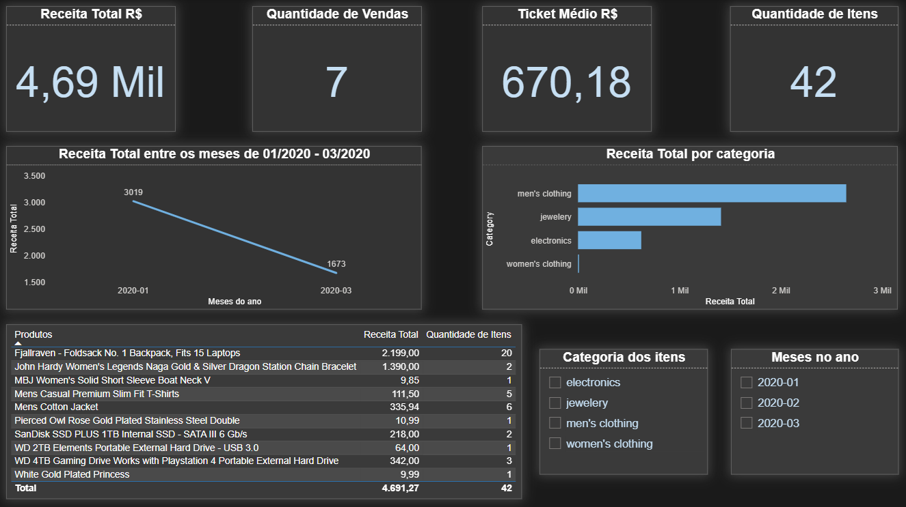

# Projeto BI - Vendas (Fake Store API)

Projeto de ETL + modelagem analitica para consumo no Power BI, com carga final em PostgreSQL.

## Objetivo

Responder perguntas de negocio sobre desempenho de vendas:

1. Qual mes gera mais receita?
2. Qual categoria gera mais receita?
3. Qual e o ticket medio?
4. Quantas vendas e quantos itens foram vendidos?
5. Quais produtos mais contribuem para a receita?

## Arquitetura ETL

Fluxo:

1. `projeto_dados/extract.py`
2. `projeto_dados/normalize.py`
3. `projeto_dados/transform.py`
4. `projeto_dados/load_fact.py`

Camadas de dados:

- `projeto_dados/data/raw`: arquivos brutos em CSV.
- `projeto_dados/data/processed`: dados normalizados em Parquet.
- `projeto_dados/data/analytics`: tabela fato analitica em Parquet (`sales_fact.parquet`).

## Modelo Analitico

Tabela fato: `sales_fact`

Colunas principais:

- `sale_id`
- `user_id`
- `sale_date`
- `product_id`
- `product_title`
- `category`
- `quantity`
- `unit_price`
- `revenue`

Regra de grao:

- 1 linha da fato representa 1 item de uma venda.

## Metricas

Medidas DAX usadas no dashboard:

```DAX
Receita Total = SUM(sales_fact[revenue])
Qtd Itens = SUM(sales_fact[quantity])
Qtd Vendas = DISTINCTCOUNT(sales_fact[sale_id])
Ticket Medio = DIVIDE([Receita Total], [Qtd Vendas])
Preco Medio = AVERAGE(sales_fact[unit_price])
```

Valores de validacao do dataset atual:

- Receita Total: `4691.27`
- Qtd Itens: `42`
- Qtd Vendas: `7`
- Ticket Medio: `670.18`
- Mes com maior receita: `2020-01` (`3018.50`)
- Categoria com maior receita: `men's clothing` (`2646.44`)

## Tecnologias

- Python 3
- Pandas
- Requests
- PyArrow
- PostgreSQL
- Psycopg
- Power BI Desktop

## Como Rodar

Pre requisitos:

- Python instalado
- PostgreSQL ativo
- Banco `pipeline` criado

1. Clonar o repositorio:

```bash
git clone https://github.com/Meyer-bit/em_constru-o.git
cd em_constru-o
```

2. Criar e ativar ambiente virtual:

Windows (PowerShell):

```powershell
python -m venv .venv
.\.venv\Scripts\Activate.ps1
```

Linux/macOS:

```bash
python -m venv .venv
source .venv/bin/activate
```

3. Instalar dependencias:

```bash
pip install -r projeto_dados/requirements.txt
```

4. Criar arquivo de ambiente:

```bash
cp projeto_dados/.env.example projeto_dados/.env
```

No Windows PowerShell, se `cp` nao funcionar:

```powershell
Copy-Item projeto_dados/.env.example projeto_dados/.env
```

5. Configurar variaveis no arquivo `projeto_dados/.env`:

```env
DB_HOST=localhost
DB_PORT=5432
DB_NAME=pipeline
DB_USER=seu_usuario
DB_PASSWORD=sua_senha
```

6. Executar pipeline:

```bash
cd projeto_dados
python extract.py
python normalize.py
python transform.py
python load_fact.py
```

7. Validar no PostgreSQL:

```sql
SELECT COUNT(*) FROM sales_fact;
SELECT SUM(revenue) FROM sales_fact;
SELECT COUNT(DISTINCT sale_id) FROM sales_fact;
```

## Dashboard Power BI

Arquivo recomendado:

- `dashboard_vendas.pbix` na raiz do projeto: `Projeto-BI/dashboard_vendas.pbix`

Estrutura recomendada de imagens:

- `docs/img/visao-geral.png`

## Prints do Dashboard


